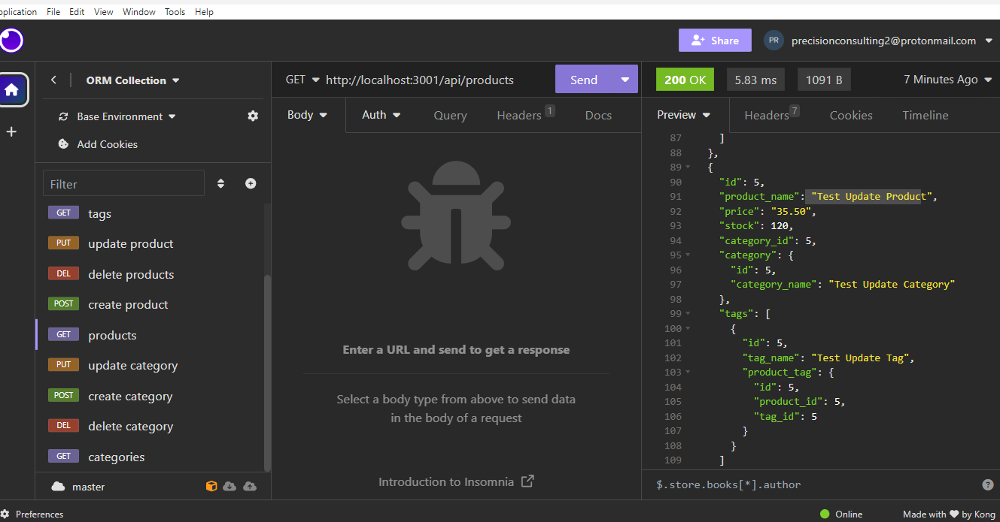

# 13 Object-Relational Mapping (ORM): E-Commerce Back End

## Your Task

Internet retail, also known as **e-commerce**, plays a significant role within the electronics industry, as it empowers businesses and consumers alike to conveniently engage in online buying and selling of electronic products. In the latest available data from 2021, the industry in the United States alone was estimated to have generated the substantial amount of US$2.54 trillion, according to the United Nations Conference on Trade and Development. E-commerce platforms like Shopify and WooCommerce provide a suite of services to businesses of all sizes. Due to the prevalence of these platforms, developers should understand the fundamental architecture of e-commerce sites.

Your task is to build the back end for an e-commerce site by modifying starter code. You’ll configure a working Express.js API to use Sequelize to interact with a MySQL database.

Because this application won’t be deployed, you’ll also need to provide a link to a walkthrough video that demonstrates its functionality and all of the acceptance criteria being met. You’ll need to submit a link to the video and add it to the readme of your project.

## User Story

```md
AS A manager at an internet retail company
I WANT a back end for my e-commerce website that uses the latest technologies
SO THAT my company can compete with other e-commerce companies
```

## Acceptance Criteria

```md
GIVEN a functional Express.js API
WHEN I add my database name, MySQL username, and MySQL password to an environment variable file
THEN I am able to connect to a database using Sequelize
WHEN I enter schema and seed commands
THEN a development database is created and is seeded with test data
WHEN I enter the command to invoke the application
THEN my server is started and the Sequelize models are synced to the MySQL database
WHEN I open API GET routes in Insomnia for categories, products, or tags
THEN the data for each of these routes is displayed in a formatted JSON
WHEN I test API POST, PUT, and DELETE routes in Insomnia
THEN I am able to successfully create, update, and delete data in my database
```

## Mock-Up



## Motivation

I wanted to learn more about sequelize and CRUD operations. Using insomnia to test the routes was a good oportunity to what Insomnia is and how to use it.

## Why

By improving my skills in this area I will be able to create more complex applications in the future. This project will help me understand the fundamentals of sequelize and CRUD operations as these skills are important to have as a full stack web developer.

## What problem does it solve?

This application will handle back end operations for an e-commerce website. It will allow users to search for products/categories/product tages, save products/categories/product tages, update products/categories/product tages and delete products/categories/product tages.

## What did you learn?

I learned why CRUD operations are important and how they will be used in future projects. I also learned how to use insomnia to test routes.

## Installation

Run `npm run seed`, then npm run dev to start the server.

## Usage

You can use this web application to login as a user then search for books, save the books you have searched for, and delete books books you have searched for.

### Link to github repo

<https://github.com/precisecoding/ORM>

### Link to video walkthrough

<https://drive.google.com/file/d/1-7QFFj6Psb_wB6nb-v2GSMHJr0pV2x4Q/view>

### License

MIT License:
<https://opensource.org/licenses/MIT>
<https://choosealicense.com/licenses/mit/>
LICENSE file included in repository.

### Thanks to everyone for support and contributions

Sources used: <https://developer.mozilla.org/en-US/>, <https://www.w3schools.com/>, <https://stackoverflow.com/>. Worked with TA George Yoo while on writing the pseudo code, once again he was very helpful.
